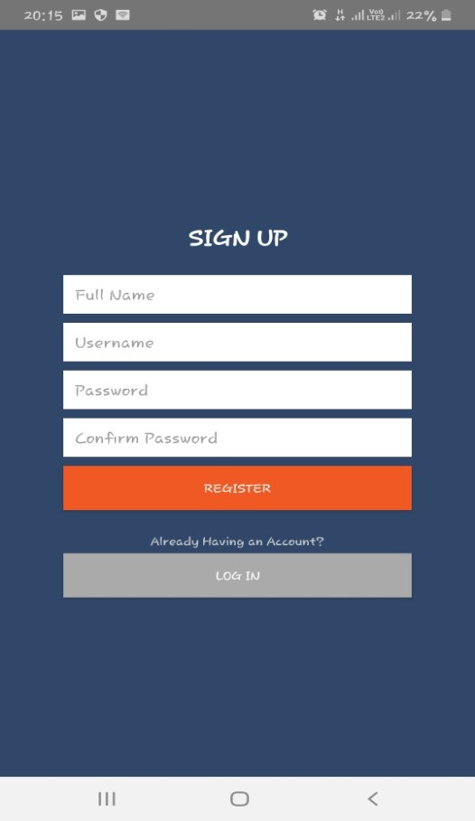
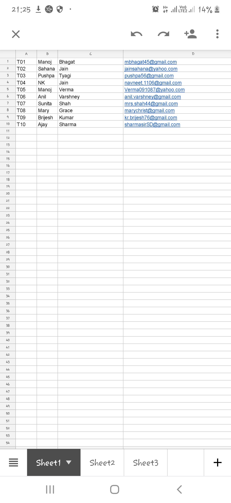
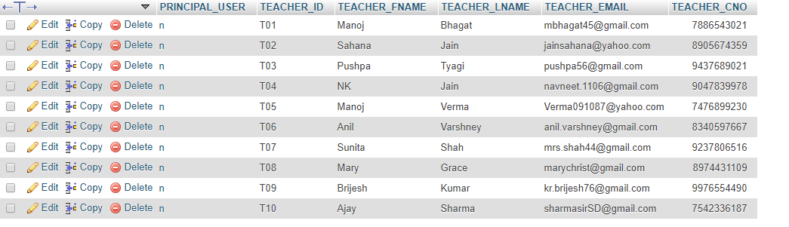
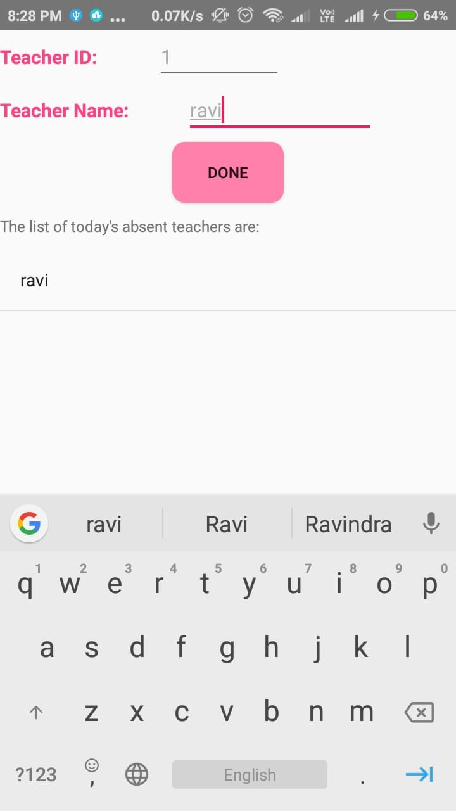

# E-SchoolSubstitutionApp

This android app helps the users or schools to get an everyday substitution timetable based on the teachers absent.This reduces the manual
and time consuming effort of creating the substitution table.

## Data Required

The school principal or clerk will login and then upload the teachers' details and the weekly timetable of all the teachers of the school
in the form of an excel sheet.
This is the one-time data.

After uploading the data,the clerk can everyday give an entry of the teacher id and its corrosponding full name.In return,the app will
generate a substitution table.

## Snapshots

### This is the excel sheet uploaded by the user from the app

### This is the excel sheet's corrosponding backend data collected from the app

### Upload the details of absent teachers here

